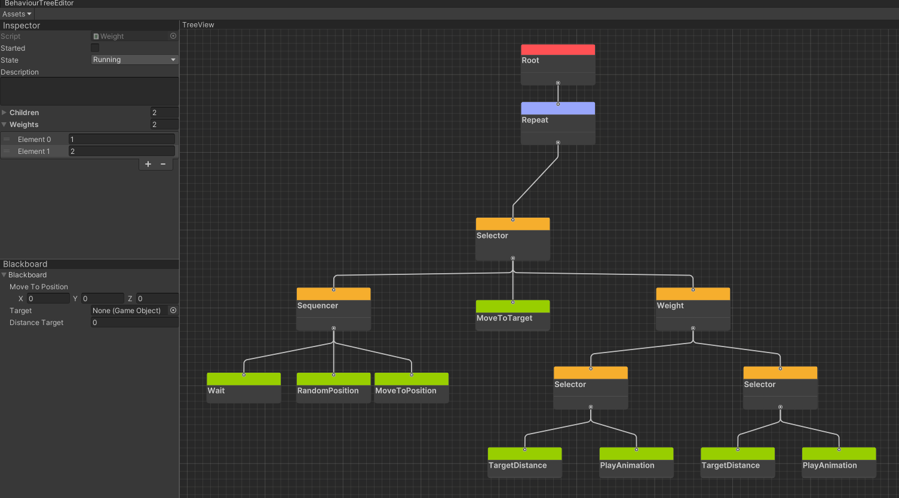
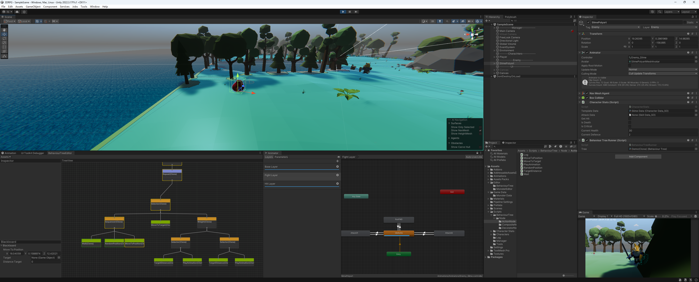
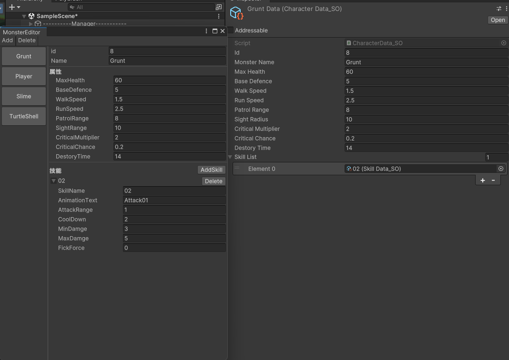

# 3DRPG

使用UI Builder从零制作行为树编辑器和怪物编辑器

- 通过Wait、RandomPostion、MoveToPosition节点实现怪物的巡逻。

- 通过TargetDistance、Cooldown、PlayAnimation、Weight节点实现怪物的攻击逻辑。

- 在PlayMode下通过行为树编辑器实时观察怪物当时状态。

- 使用怪物编辑器修改怪物的基础属性、添加删除技能、配置技能数值。

